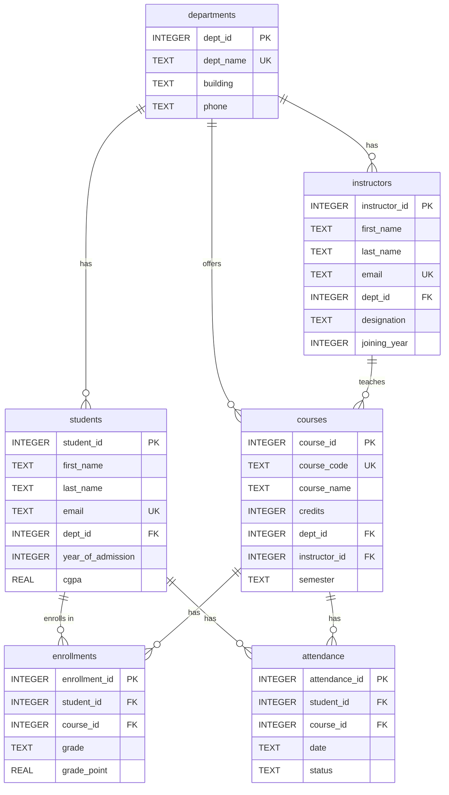

# BanglaSQL — ER Diagram

## Table Summary

| Table | Rows | Description |
|---|---|---|
| departments | 10 | Academic departments |
| instructors | 50 | Faculty members |
| students | 304 | Enrolled students |
| courses | 80 | Offered courses |
| enrollments | 471 | Student-course registrations with grades |
| attendance | 500 | Per-session attendance records |

## Relationships

- **departments → instructors**: One department has many instructors
- **departments → students**: One department has many students
- **departments → courses**: One department offers many courses
- **instructors → courses**: One instructor teaches many courses
- **students → enrollments**: One student has many enrollments
- **courses → enrollments**: One course has many enrollments
- **students → attendance**: One student has many attendance records
- **courses → attendance**: One course has many attendance records
